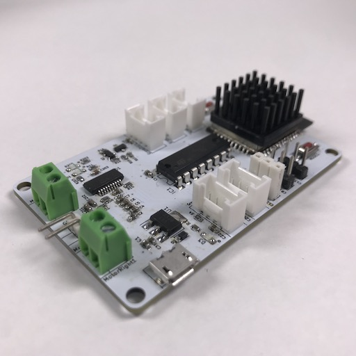
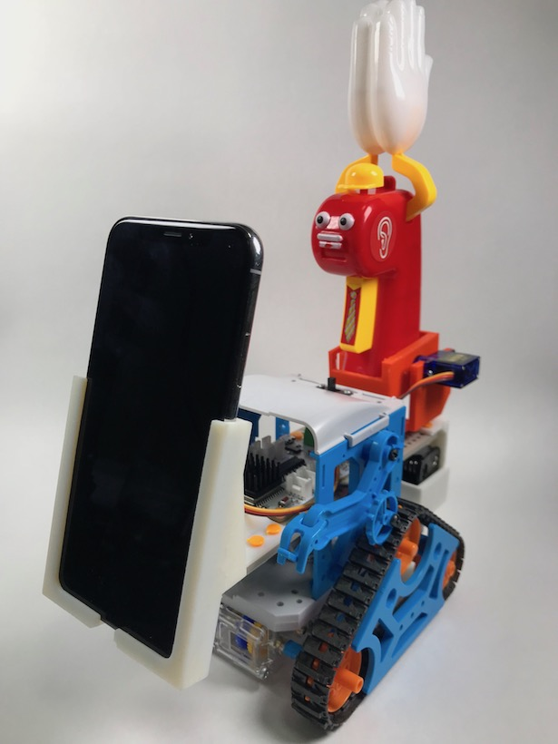

# ESP32_camrobo

## Overview

[タミヤのカムプログラムロボット工作セット](http://www.tamiya.com/japan/products/70227/index.html) をマイコンロボット化するためのボート **ESP32Camrobo** と、それを使用した作例 **CrappyPark** についてのプロジェクトです。

## Get Started

### Arduinoでプログラミングするための準備

Arduinoでプログラムをボードに書き込むために以下の環境設定を行う。  

#### ESP32 ボードライブラリ

ESP32のBLE機能を使用するので、ESP32のボードライブラリを追加する。  

[arduino-esp32](https://github.com/espressif/arduino-esp32)  
**Installation Instructions** を参照してインストールする。  

参考) [Arduino IDEでESP32 BLEライブラリを導入](https://qiita.com/tomorrow56/items/afa06e206eec9fafcc7a)

#### ライブラリ

Arduino の **ライブラリマネージャ** から以下のライブラリをインストールする。  

- [Adafruit_NeoPixel](https://github.com/adafruit/Adafruit_NeoPixel)

## カムプログラムロボットの改造

ESP32Camroboをカムプログラムロボットに搭載し、改造する方法について解説しています。  

- [カムロボットの工作](./docs/make_robot/README.md)

  

*作成例(Step3)*

