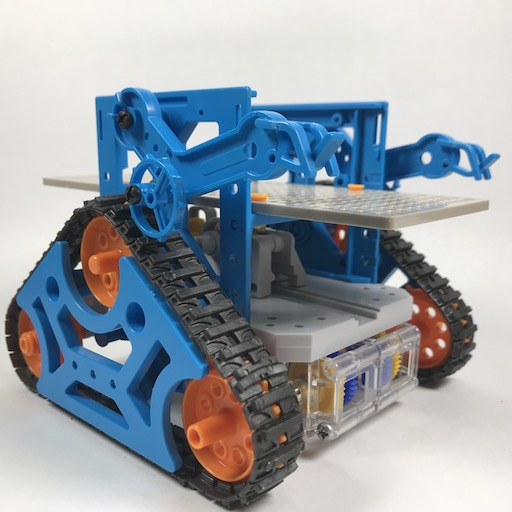
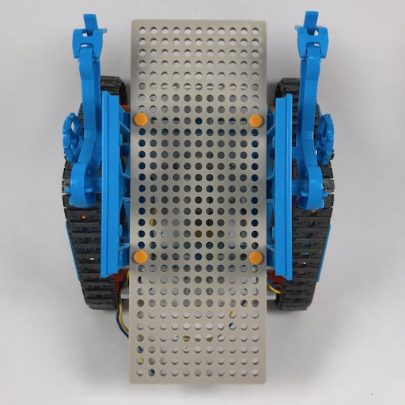
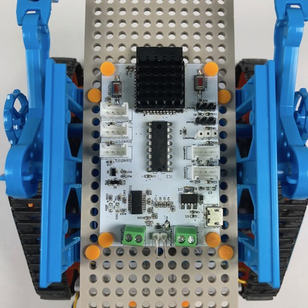
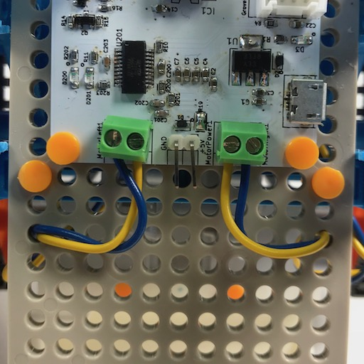
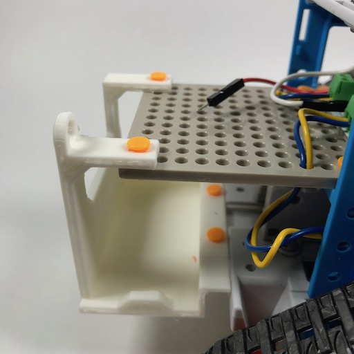
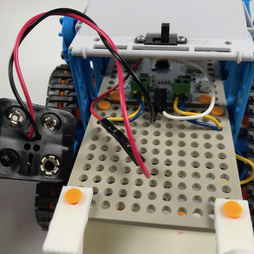
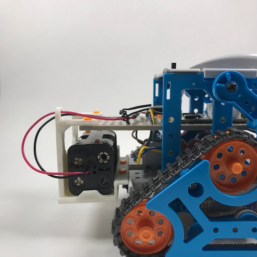

# Step.1 リモコンロボット化

## Overview

ベースとなるカムプログラムロボットにESP32Camrobo基盤を搭載して、スマートフォンからBLEで制御できるロボットに改造します。  
この工作は、他の全ての工作の元となります。  

## 部品の準備

- 以下の部品を購入します。
    - [カムプログラムロボット工作セット](http://www.tamiya.com/japan/products/70227/index.html)
    - ユニバーサルプレートとプッシュリベット(以下の組み合わせのうちどちらか)
        - [ユニバーサルプレート](http://www.tamiya.com/japan/products/70098/index.html) & [3mmプッシュリベットセット](http://www.tamiya.com/japan/products/70155/index.html)
        - [ユニバーサルプレート （2枚セット）](http://www.tamiya.com/japan/products/70157/index.html)
    - [電池ボックス　単３×４本　リード線・背中合わせ BH-343-3A](http://akizukidenshi.com/catalog/g/gP-02678/)
    - タッピング Aナベ 2x5mm ビス　2本
- 3Dプリンタでパーツを出力します。
    - [電池ボックスホルダー](../../3d_parts/battery-holder.stl)

## ESP32Camrobo基盤の準備

電池ボックスの電池のみで動くようにするため、基盤のR19を半田付けでブリッジしてショートさせます。

## 組立て

### 1. ユニバーサルプレートの固定

カムプログラムロボットを一旦組み立てます。  
カムプログラムロボットの説明書を参考に、ユニバーサルプレートを設置します。  

**固定位置に注意してください。写真を参考に、後方に10穴分余るようにしてください。**

### 2. ESP32Camrobo基盤の設置

ユニバーサルプレートの中央にESP32Camrobo基盤を固定します。  

- アンテナ側が前方に来るようにします。
- プッシュリベットを使用して固定します。

ESP32Camrobo基盤にモーターを接続します。  

- カムプログラムロボットのモーターを `MotorLeft`, `MotorRight` ターミナルに接続します。
- カムプログラムロボットから見て左のモーターを `MotorLeft` に、右のモーターを `MotorRight` に、それぞれ接続します。

### 3. 電池ボックスの設置

電池ボックスホルダーをカムプログラムロボットに固定します。  
本体の土台部分に2箇所、ユニバーサルプレートの後方に2箇所、それぞれプッシュリベットを使用して固定します。  

電池ボックスを `+5V`, `GND` ピンに接続します。  

- 適宜、QIコネクタ等を使用してください。
- 間に、カムプログラムロボットに付属のスイッチを挟むと操作がしやすくなります。

電池ボックスを電池ボックスホルダーに格納します。  
幅が広い方向を縦にしてください。  

## プログラムの書き込み

ESP32Camrobo基盤にArduinoでプログラムを書き込みます。  

[ESP32_ClappyPark](../../ESP32_ClappyPark_v03)  

## 動作確認

リモコンのアプリを端末(スマートフォン or PC)のブラウザ開き、接続と操作を試します。  

- https://crappypark.uzukiaoba.net/

### リモコンアプリが使用可能な端末について

[Web Bluetooth](https://webbluetoothcg.github.io/web-bluetooth/)が使用可能な端末で利用できます。

- Chromeがインストールされた Android ５.0以上のAndroid端末
- Chromeがインストールされた Macbook, Macbook Pro
- Chromeがインストールされ、なおかつBLEをサポートする Windows PC

